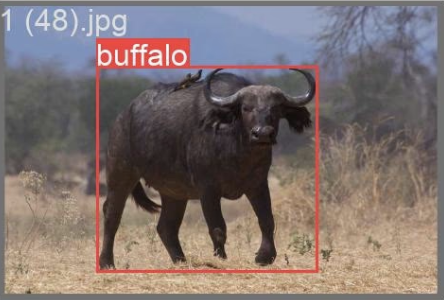
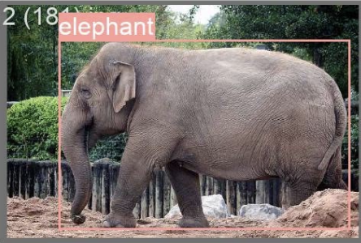
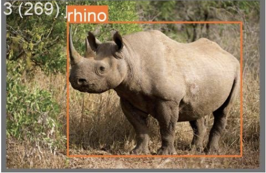
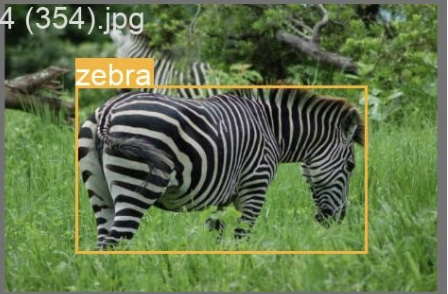

# African Wildlife Example

This is an example FEDn project that trains the Ultralytics YOLOv8n model to classify buffalos, elephants, rhinos and zebras. See a few examples below,










## Step 1:. Downloading the data

Download the dataset from the following link and extract it to the `datasets` directory:
<https://github.com/ultralytics/assets/releases/download/v0.0.0/african-wildlife.zip>


## Step 2: Partitioning the data

To partition the data for each client, run the following command:

```bash
python3 partition_data.py african-wildlife <num_splits>
```
Replace `<num_splits>` with the number of clients you want to partition the data for.

This generates the dataset partitions in the 'datasets' directory. These partitions needs to be distributed to the respective clients and renamed to 'fed_dataset' instead of 'african-wildlife_split_X.

## Step 3: Setting up the global_config.yaml

Inside the 'client' folder configure the 'global_config.yaml' in the following way:

```bash
# Configuration for YOLOv8 Model and Dataset Paths
# Adjust settings here to define model size, class details, and dataset paths

model_size: nano  # Options: nano, small, medium, large, extra-large
num_classes: 4    # Number of classes
class_names: ['Buffalo', 'Elephant', 'Rhino','Zebra']  # A list of class names

train: fed_dataset/train/images  # Configure paths (usually not needed to be configured)
val: fed_dataset/valid/images
test: fed_dataset/test/images
```

## Step 4: Return to the root guide and follow the instructions from there
Now your dataset is ready and you have configured the global settings for the YOLOv8 model. Return to the root guide and follow the instructions from there to continue with the federated learning process.
